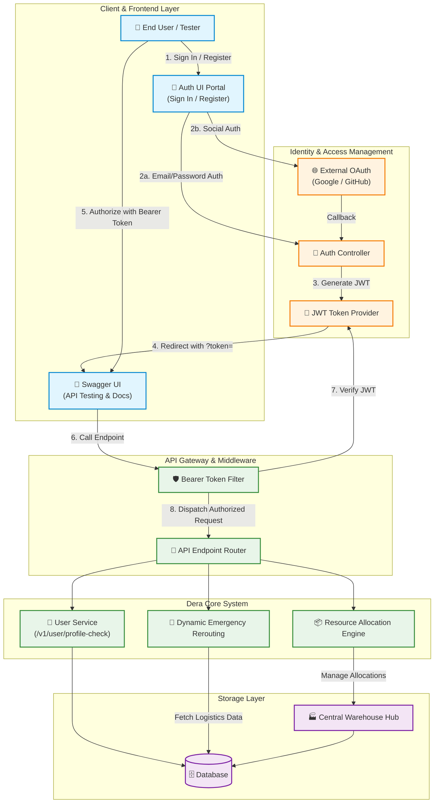
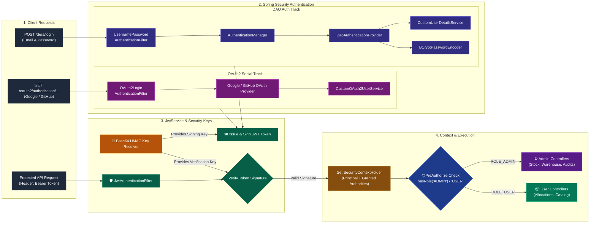
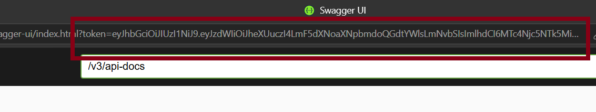

# DERA (Dynamic Emergency Rerouting & Allocation System)

DERA is a warehouse inventory management and order allocation system built with Spring Boot 3 and Java 21. It features intelligent dynamic rerouting using the **Haversine formula**, robust hybrid database concurrency control, stateless JWT authentication, and OAuth2 social logins.

<details>
<summary><b>Table of Contents</b></summary>

- [Live Demo & Documentation](#live-demo--documentation)
- [ Key Architectural Highlights](#key-architectural-highlights)
- [ System Architecture Diagrams](#system-architecture-diagrams)
- [ API Endpoint Reference](#api-endpoint-reference)
- [ Seed Admin Credentials](#seed-admin-credentials)
- [Sample Test Payloads](#sample-test-payloads)
- [ Step-by-Step Testing Guide](#step-by-step-testing-guide)
- [ Local Setup & Installation](#local-setup--installation)

</details>

---

## Live Demo & Documentation

* **Live Deployment:** `[YOUR_LIVE_DEPLOYMENT_URL_HERE]` *(Deployment Pending)*
* **Interactive Swagger UI:** `[YOUR_LIVE_DEPLOYMENT_URL_HERE]/swagger-ui/index.html`  
* **Demo Video:** `[YOUR_DEMO_VIDEO_LINK_HERE]`

---
## Key Architectural Highlights

### 1. Haversine Dynamic Rerouting Engine
* Calculates geographical distance (lat/long) to alternate warehouses upon primary stock deficits.
* Sorts candidates by proximity and automatically reroutes allocations.

### 2. Hybrid Database Concurrency Control
* **Pessimistic Locking (`FOR UPDATE`):** Applied to single-item order allocations and cancellation restocks to guarantee thread safety, preventing double allocations and lost updates under heavy concurrent traffic.
* **Optimistic Locking (`@Version`):** Utilized on inventory items and warehouse stock entities to detect concurrent administrative modifications and block stale form overwrites.

### 3. Automated Database Schema Versioning (Flyway)
* Uses **Flyway** migration scripts (`V1__...sql`, `V2__...sql`) to automatically version, create, and update PostgreSQL tables upon application startup.
* Eliminates manual DDL script execution and guarantees consistent database schema across developer environments.

### 4. Pagination & Sorting
* Built-in support for **Spring Data `Pageable`** across heavy administrative endpoints.
* Enables query-level pagination (`page`, `size`, `sort`) to maintain low memory footprints and fast response times on large datasets.

### 5. Comprehensive Security Architecture
* **Stateless Authentication:** Dual support for native DAO Authentication (Email/Password) via JWT tokens and **OAuth2 (Google & GitHub)** social logins.
* **Role-Based Access Control (RBAC):** Fine-grained permission checks distinguishing `ROLE_USER` and `ROLE_ADMIN` endpoints via `@PreAuthorize("hasRole('ADMIN')")`.
* **Automated Data Seeding:** Startup initialization via `CommandLineRunner` to seed a default Super Admin account if none exists.
---

## System Architecture Diagrams
### End-to-End Application & Dynamic Rerouting Flow

---
### Dual-Track Auth & Security Filter Chain


---

## API Endpoint Reference

### User & Authentication (`user-controller`)
| Method | Endpoint | Access | Description |
| :--- | :--- | :--- | :--- |
| `POST` | `/dera/register` | Public | Register a new standard user |
| `POST` | `/dera/login` | Public | Authenticate user & retrieve JWT token |
| `POST` | `/dera/admin/register-admin` | Admin | Onboard a new administrator account |

### Inventory Management (`inventory-item-controller`)
| Method | Endpoint | Access | Description |
| :--- | :--- | :--- | :--- |
| `POST` | `/dera/admin/stock` | Admin | Add or restock inventory items |
| `PUT` | `/dera/admin/item/{itemId}/details` | Admin | Update item metadata |
| `PATCH` | `/dera/admin/item/{itemId}` | Admin | Partial updates to inventory item |
| `GET` | `/dera/admin/inventory` | Admin | View all inventory stock levels |
| `GET` | `/dera/admin/item/search` | Admin | Search inventory items with criteria |
| `GET` | `/dera/admin/item/{itemId}` | Admin | Fetch single item details by ID |
| `GET` | `/dera/user/inventory` | User/Admin | Browse public inventory list |
| `GET` | `/dera/user/item/{itemId}` | User/Admin | View item details |
| `GET` | `/dera/user/warehouse/{warehouseId}` | User/Admin | List inventory by specific warehouse |
| `GET` | `/dera/admin/warehouse/{warehouseId}` | Admin | Administrative warehouse inventory lookup |

### Order Allocation & Rerouting (`allocation-record-controller`)
| Method | Endpoint | Access | Description |
| :--- | :--- | :--- | :--- |
| `POST` | `/dera/user/allocation` | User | Request stock allocation (Triggers Haversine reroute if out of stock) |
| `PATCH` | `/dera/user/allocation/{allocationId}/cancel` | User | Cancel an allocation record & trigger pessimistic restock |
| `GET` | `/dera/user/allocation/{allocationId}` | User | Get allocation details by ID |
| `GET` | `/dera/user/allocation/war/{warId}` | User | View allocations for a specific warehouse |
| `GET` | `/dera/admin/allocation` | Admin | Get paginated list of all allocations |
| `GET` | `/dera/admin/allocation/item/{itemId}` | Admin | View allocation history for a specific item |

### Warehouse Operations (`warehouse-controller`)
| Method | Endpoint | Access | Description |
| :--- | :--- | :--- | :--- |
| `POST` | `/dera/admin/warehouse` | Admin | Register a new warehouse with geo-coordinates |
| `PATCH` | `/dera/admin/warehouse/{wareId}` | Admin | Update warehouse location or metadata |
| `GET` | `/dera/user/warehouses` | User/Admin | Get list of active warehouses |
| `GET` | `/dera/user/warehouse/{wareId}` | User/Admin | Get specific warehouse details |
---

## Seed Admin Credentials

An initial admin account is automatically seeded into PostgreSQL upon application startup.
Test out the admin endpoints with it.
(Only an admin can add another admin)

| Field | Value                           |
| :--- |:--------------------------------|
| **Email** | `ayu.s28.ayushisingh@gmail.com` |
| **Password** | `sunflower`                     |
| **Role** | `ROLE_ADMIN`                    |
---
## Step-by-Step Testing Guide

Follow these steps to authenticate and test protected endpoints using the Auth Portal and Swagger UI:

1. **Access the Auth Portal:**
   Navigate to the portal URL


2. **Authenticate (Register or Login):**  
  * **New User:** Switch to the **Register** tab to create a new `ROLE_USER` account.
  * **Existing User / Admin:** Use the **Sign In** tab with valid credentials, or choose **Google** / **GitHub** OAuth2.

    


3. **Retrieve Your JWT Token:**
  * Upon successful authentication, you will be automatically redirected to the Swagger UI page.
  * Look at your browser address bar and copy the JWT token value from the URL query parameter (e.g., `.../swagger-ui/index.html?token=YOUR_JWT_TOKEN`).
 
    

4. **Authorize Swagger UI:**
  * Click the green **Authorize** 🔓 button at the top right of the Swagger UI interface.
  * Paste your copied token into the **Value** field (format: `Bearer YOUR_JWT_TOKEN` or your raw token string) and click **Authorize**, then **Close**.


5. **Test Endpoints:**
  * You are now authenticated. Expand any endpoint and click **Try it out** to send requests based on your account's assigned role (`ROLE_USER` or `ROLE_ADMIN`).

---
## Sample Test Payloads
Use the sample JSON bodies in the PDF to quickly test endpoints in Swagger UI or Postman

<a href="src/main/resources/static/DeraAPI_sample_payload.pdf" target="_blank">Click to Open PDF</a>

---
## Local Setup & Installation

Follow these steps to configure, build, and run the project on your local machine.

### Prerequisites
* **Java 21** (or 17+)
* **Maven 3.8+**
* **PostgreSQL** database running locally 

---

### 1. Clone the Repository

```bash
git clone https://github.com/ayus28ayushi-ai/supply-allocation-rerouting-api.git
```

### 2. Configure Environment Variables

⚠️ **Important:** Update ***src/main/resources/application.properties*** with your actual database credentials and API keys before running the application. Make sure to add application.properties to your .gitignore if it contains sensitive secrets.

Open ***src/main/resources/application.properties*** and replace the placeholder values:
```env
spring.datasource.password=${POSTGRE_PASSWORD}
jwt.secret=${JWT_SECRET_KEY}

app.admin.email=${ADMIN_EMAIL}
app.admin.password=${ADMIN_PASSWORD}

spring.security.oauth2.client.registration.google.client-id=${GOOGLE_CLIENT_ID}
spring.security.oauth2.client.registration.google.client-secret=${GOOGLE_CLIENT_SECRET}

spring.security.oauth2.client.registration.github.client-id=${GITHUB_CLIENT_ID}
spring.security.oauth2.client.registration.github.client-secret=${GITHUB_CLIENT_SECRET}
```

### 3. Database Initialization

Ensure PostgreSQL is running and create the target database:

```sql
CREATE DATABASE triage_dera_db;
```

### 4. Build and Run the Application

#### Clean and build the project

```bash
./mvnw clean package -DskipTests
```

#### Launch the Spring Boot application

```bash
./mvnw spring-boot:run
```

### 5. Verify Setup

Once the application has started, access the following URLs in your browser:

* **Auth Portal:** http://localhost:8080/login.html
---
## Author
  ***Name*** : Ayushi Singh  
  ***GitHub Profile*** : https://github.com/ayus28ayushi-ai